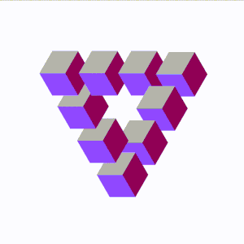

### Hi there 👋

My name is Juan Carlos. 🔭 I am a mathematician working on the design and integration of online learning modules, free interactive [mathematical applets](https://jcponce.github.io/) and [books](https://complex-analysis.com/).

 I also share animations about mathematics and physics on [Twitter](https://twitter.com/jcponcemath) and appreciate ❤️ your [support](https://www.patreon.com/jcponce). Thanks 😄.

  

<!--
**jcponce/jcponce** is a ✨ _special_ ✨ repository because its `README.md` (this file) appears on your GitHub profile.

Here are some ideas to get you started:

- 🔭 I’m currently working on ...
- 🌱 I’m currently learning ...
- 👯 I’m looking to collaborate on ...
- 🤔 I’m looking for help with ...
- 💬 Ask me about ...
- 📫 How to reach me: ...
- 😄 Pronouns: ...
- ⚡ Fun fact: ...
-->
